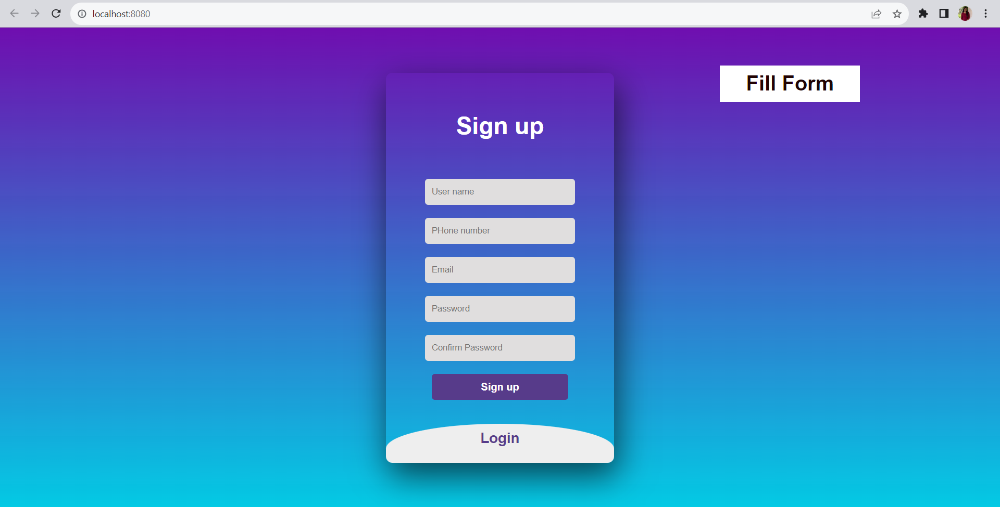
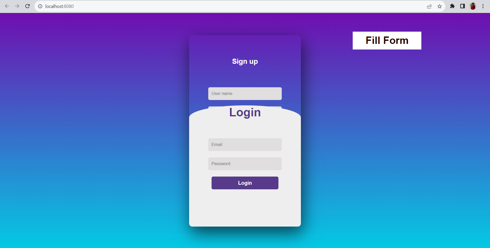
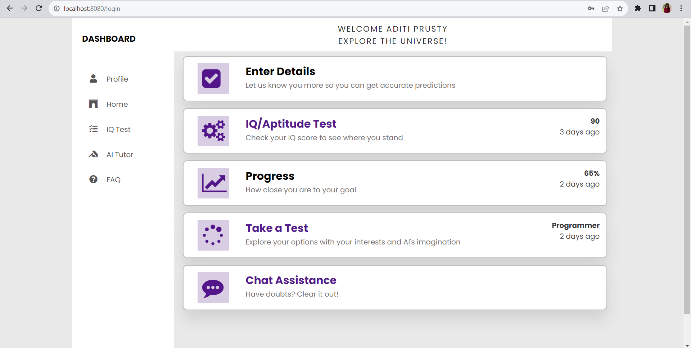
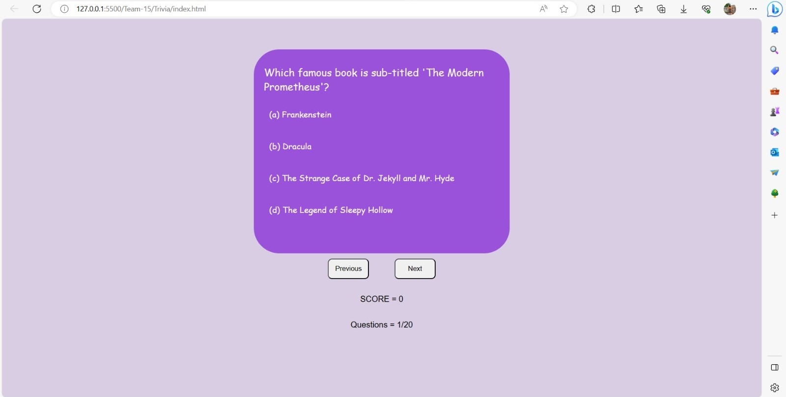
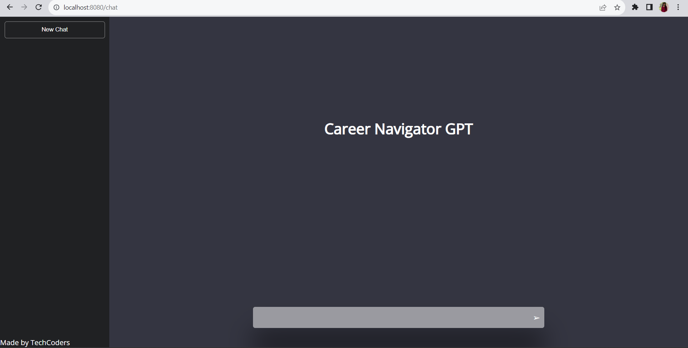
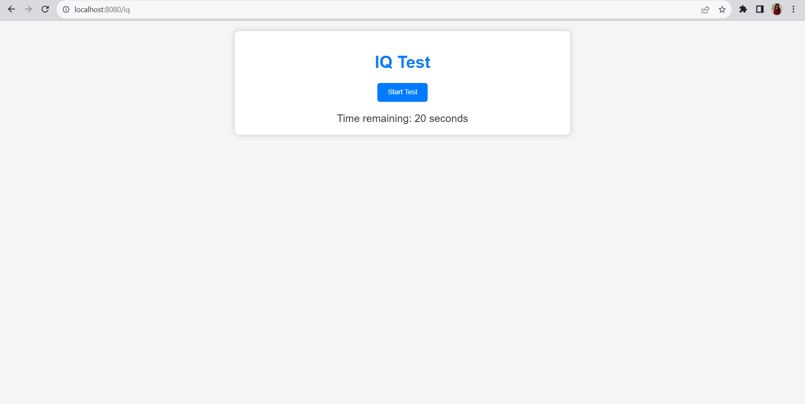
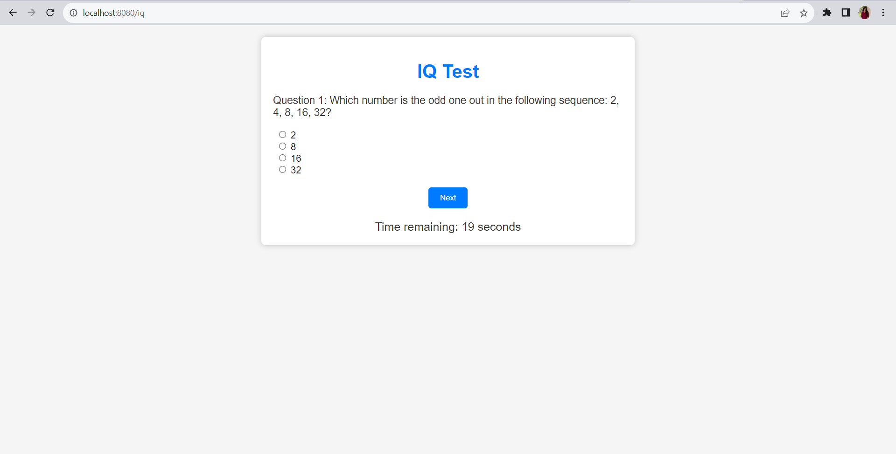

<h1>TEAM-15</h1>

Installation packages required : express, mongodb, mongoose, body-parser, ejs, nodemon

To start our node server using local host -

Go to Terminal and enter the following commands :

```
1. cd Login
2. npm run dev
```

To start our python server using local host -

Go to Terminal and enter the following commands :

```
1. pip install pandas 
2. pip install scikit-learn 
3. pip install flask
4. python app.py
```

The problem statement we are working on is : "Making career choices and AI based counselling accessible to every child at secondary level along with aptitude tests and detailed career paths."

Our solution aims personalized recommendations, job descriptions, and salary insights to help students make informed decisions and optimize their educational pathways, using AI.

* The login/register page allows the user to create their own account. 

| Register | Login |
|---|---|
|  |  |

* The dashboard keeps the track of the user's progress and also gives the user some additional options and features so that he can get a guided and defined path for his career.
  


* This is a trivia quiz and chatbot application that helps users test their knowledge on various topics and clear their doubts.
* The Trivia questions allow the user to test their knowledge on various topics based on their given choices. This will enhance their idea of their own progress, as well as motivate them to work harder for their desired goal.

A chatbot has been added which is not fully functional yet, but its key features will be :
* Always Available: The chatbot is your round-the-clock career advisor, ready to chat with you day or night. It makes career exploration convenient for you.
* Instant Homework Help: AI-powered tutoring platforms act like 24/7 study partners. Whether it's math, science, or languages, they're there to give you quick help and explanations when you're stuck on assignments.

| Trivia | Chat-Bot |
|---|---|
|  |  |

* The IQ/Aptitude test will let the user know how much more they need to be prepared for various competitive exams as the IQ test is a very important part of those exams.

| IQ Test | IQ Test |
|---|---|
|  ||


